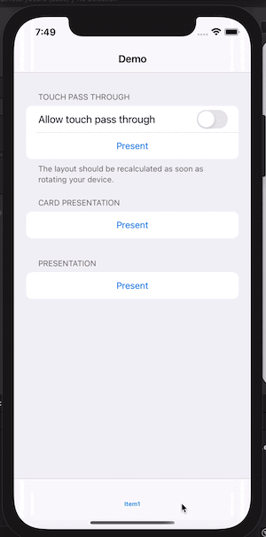

# FloatingView
This project is an example of how to use the UIPresentationController to create a presentation view suitable with your app style.
I have also created 2 examples, it's Card presentation and a touch pass-through presentation. Although It's not a perfect but it's the first step for you to get a referennce.

## Illustrator

